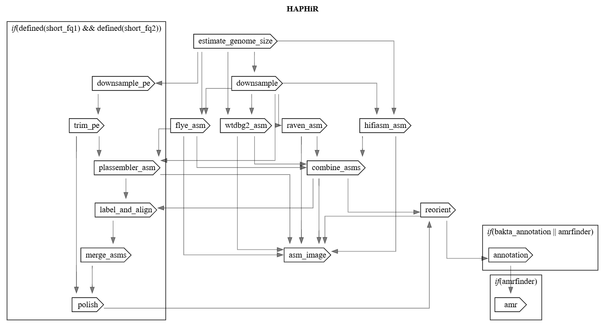

# HAPHiR: Hybrid Assembly of PacBio HiFi and Illumina Reads

[](https://dockstore.org/workflows/github.com/Kincekara/haphir/HAPHiR)
[](https://terra.bio/)
[](https://cromwell.readthedocs.io/en/stable/)
[](https://miniwdl.readthedocs.io/en/latest/)
[](https://github.com/Kincekara/haphir/actions/workflows/check-wdl.yml)

***This repo is under development!***

HAPHiR performs high‑quality bacterial genome assembly using PacBio HiFi long reads and Illumina short reads, combining accuracy, robustness, and efficient cloud execution.

The workflow runs multiple long‑read assemblers in parallel (Flye, Hifiasm, Raven, wtdbg2) and generates a unified, high‑confidence consensus assembly using [Autocycler](https://github.com/rrwick/Autocycler). Small circular plasmids are recovered through a dedicated hybrid assembly step using [Plassembler](https://github.com/gbouras13/plassembler), ensuring both chromosomal and plasmid components are accurately reconstructed.

HAPHiR is designed for cloud‑native execution on [Terra](https://terra.bio/), but can also be run locally using WDL executer such as [miniwdl](https://miniwdl.readthedocs.io/en/latest/) or [Cromwell](https://cromwell.readthedocs.io/en/latest/).

## Features

- **Multi-assembler consensus**: Runs 4 independent long-read assemblers (Flye, Hifiasm, Wtdbg2, Raven) and combines them using Autocycler for enhanced accuracy
- **HiFI only support**: Works with PacBio HiFi-only data or hybrid HiFi + Illumina data
- **Plasmid recovery**: Dedicated plasmid assembly and recovery using Plassembler
- **Flexible inputs**: Accepts PacBio BAM or FASTQ files, automatically converts as needed
- **Quality control**: Includes read trimming, genome size estimation, and coverage normalization
- **Polishing**: Short-read polishing with Polypolish 
- **Annotation**: Optional standardized annotation with Bakta
- **Antimicrobial resistance detection**: Optional AMR analysis with AmrFinderPlus
- **Cloud-ready**: Designed for scalable execution on Terra
- **Containerized**: All tools run in Docker containers for reproducibility

## Terra

- The pipelien available as a [Dockstore workflow](https://dockstore.org/workflows/github.com/Kincekara/haphir/HAPHiR) that can be imported directly into Terra for cloud execution.

### Inputs

| Input | Type | Description |
|-------|------|-------------|
| `id` | String | Sample identifier |
| `long_fq` | File | PacBio HiFi reads (FASTQ or BAM) |
| `short_fq1` | File? | Illumina forward reads (optional) |
| `short_fq2` | File? | Illumina reverse reads (optional) |
| `organism` | String? | Taxonomic name used for annotation (optional) |
| `bakta_annotation` | Boolean | Run Bakta annotation (default: false) |
| `amrfinder` | Boolean | Run AmrFinderPlus AMR detection (default: true) |

## Local Execution

### Installation

```bash
git clone https://github.com/Kincekara/haphir.git
```

### Single Sample Assembly

Use the single-sample workflow `wf_haphir.wdl`:

```bash
miniwdl run ~/haphir/workflows/wf_haphir.wdl \
  id=sample1 \
  long_fq=sample1.hifi.fastq.gz \
  [ short_fq1=sample1.R1.fastq.gz ] \
  [ short_fq2=sample1.R2.fastq.gz ] \
  [ organism="Escherichia coli" ] \
  [ bakta=true ] \
  [ amrfinder=true ]
```
Taxon name is optional and only used bakta annotation if enabled. If short reads are not provided, the workflow will skip plasmid recovery and polishing steps and only run the long-read assembly and consensus generation. Bakta and AmrFinderPlus can be enabled or disabled based on user preference.

### Batch Processing

For batch run, you can use `wf_haphir_batch.wdl` with a tab-seperated samplesheet as formatted like below. 

Example `samplesheet.tsv` format:

```tsv
id  long_fq short_fq1	short_fq2 organism
sample1 /path/to/sample1.hifi.bam  /path/to/sample1.R1.fastq.gz /path/to/sample1.R2.fastq.gz  Escherichia coli
sample2 /path/to/sample2.hifi.fastq.gz  /path/to/sample2.R1.fastq.gz  /path/to/sample2.R2.fastq.gz
sample3 /path/to/sample3.hifi.fastq.gz
```

Run the batch workflow:

```bash
miniwdl run /path/to/haphir/workflows/wf_haphir_batch.wdl \
samplesheet=samplesheet.tsv 
[ bakta=true ] \
[ amrfinder=true ]
```


## Pipeline Overview




## Output Files

Primary outputs exposed by the workflow:

| Output | Description |
|------|-------------|
| `final_assembly` | Final reoriented consensus FASTA |
| `dnaapler_summary` | Dnaapler orientation report |
| `autocycler_assembly` | Consensus assembly FASTA from Autocycler |
| `autocycler_graph` | Autocycler assembly graph |
| `asm_viz` | Assembly comparison and visualization |
| `fastp_report` | Fastp trimming report (when paired reads are provided) |
| `plassembler_plasmids` | Recovered plasmid FASTA |
| `plassembler_graph` | Plassembler assembly graph |
| `plassembler_summary` | Plassembler summary report |
| `minimap2_report` | Minimap2 overlap report |
| `merge_summary` | Assembly merge decisions summary |
| `bakta_outputs` | Bakta annotation outputs |
| `amrfinder_report` | AmrFinderPlus report |
| `program_versions` | Captured tool version strings |

> Some outputs are only generated when paired Illumina reads are provided or when annotation/AMR detection is enabled.


## Contributing

Contributions are welcome. Please:

1. Fork the repository
2. Create a feature branch
3. Add or update code, workflows, or documentation
4. Validate changes locally
5. Submit a pull request

## License

This project is licensed under the MIT License. See [LICENSE](LICENSE) for details.

## Support

For questions or issues, please open an issue on GitHub.