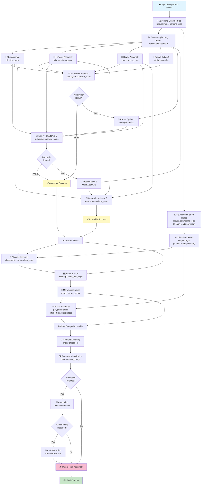

# HAPHiR: Hybrid Assembly of PacBio HiFi and Illumina Reads

[](https://dockstore.org/workflows/github.com/Kincekara/haphir/HAPHiR)
[](https://terra.bio/)
[](https://cromwell.readthedocs.io/en/stable/)
[](https://miniwdl.readthedocs.io/en/latest/)
[](https://github.com/Kincekara/haphir/actions/workflows/check-wdl.yml)


HAPHiR performs high‑quality bacterial genome assembly using PacBio HiFi long reads and Illumina short reads, combining accuracy, robustness, and efficient cloud execution.

The workflow runs multiple long‑read assemblers in parallel (Flye, Hifiasm, Raven, and one of Wtdbg2, HiCanu, LJA assemblers) It tries to generates a unified, high‑confidence consensus assembly using [Autocycler](https://github.com/rrwick/Autocycler). If fails, automaticaly repeats Autocycler step with a different assembler combination. Small circular plasmids are recovered through a dedicated hybrid assembly step using [Plassembler](https://github.com/gbouras13/plassembler), ensuring both chromosomal and plasmid components are accurately reconstructed.

HAPHiR is designed for cloud‑native execution on [Terra](https://terra.bio/), but can also be run locally using WDL executer such as [miniwdl](https://miniwdl.readthedocs.io/en/latest/) or [Cromwell](https://cromwell.readthedocs.io/en/latest/).

## Features

- **Multi-assembler consensus**: Runs 4 independent long-read assemblers (Flye, Hifiasm, Wtdbg2, Raven) and combines them using Autocycler for enhanced accuracy
- **HiFI only support**: Works with PacBio HiFi-only data or hybrid HiFi + Illumina data
- **Plasmid recovery**: Dedicated plasmid assembly and recovery using Plassembler
- **Flexible inputs**: Accepts PacBio BAM or FASTQ files, automatically converts as needed
- **Quality control**: Includes read trimming, genome size estimation, and coverage normalization
- **Polishing**: Short-read polishing with Polypolish 
- **Annotation**: Optional standardized annotation with Bakta
- **Antimicrobial resistance detection**: Optional AMR analysis with AmrFinderPlus
- **Cloud-ready**: Designed for scalable execution on Terra
- **Containerized**: All tools run in Docker containers for reproducibility

## Terra

- The pipeline is available as a [Dockstore workflow](https://dockstore.org/workflows/github.com/Kincekara/haphir/HAPHiR) that can be imported directly into Terra for cloud execution.

### Inputs

| Input | Type | Description |
|-------|------|-------------|
| `id` | String | Sample identifier |
| `long_fq` | File | PacBio HiFi reads (FASTQ or BAM) |
| `short_fq1` | File? | Illumina forward reads (optional) |
| `short_fq2` | File? | Illumina reverse reads (optional) |
| `organism` | String? | Taxonomic name used for annotation (optional) |
| `bakta_annotation` | Boolean | Run Bakta annotation (default: false) |
| `amrfinder` | Boolean | Run AmrFinderPlus AMR detection (default: true) |
| `assembly_preset` | Int | Assembly preset number to determine the order of assemblers  (1, 2, or 3; default: 1) |

>[!NOTE]
> HAPHiR runs Flye, Hifiasm, and Raven assemblers in parallel by default. The fourth assembler can be selected from Wtdbg2, HiCanu, or LJA based on the `assembly_preset` input. The presets define the order in which the long-read assemblers are run, allowing users to prioritize specific assemblers based on their preferences or prior experience. In case of failure in generating a consensus assembly, the workflow will automatically retry with a different assembler combination based on the selected preset. The presets are defined as follows: 
> - preset 1: Wtdbg2, Canu, LJA
> - preset 2: Canu, LJA, Wtdbg2
> - preset 3: LJA, Wtdbg2, Canu


## Local Execution

### Requirements

- [MiniWDL](https://miniwdl.readthedocs.io/en/latest/) or [Cromwell](https://cromwell.readthedocs.io/en/latest/) installed
- A container engine (Docker, Apptainer, etc.) installed and running locally for container execution
- 8+ CPU, 32+ GB RAM, and sufficient disk space for assemblies

### Installation

```bash
git clone https://github.com/Kincekara/haphir.git
```

### Single Sample Assembly

Use the single-sample workflow `wf_haphir.wdl`:

```bash
miniwdl run /path/to/haphir/workflows/wf_haphir.wdl \
  id=sample1 \
  long_fq=sample1.hifi.fastq.gz \
  [ short_fq1=sample1.R1.fastq.gz ] \
  [ short_fq2=sample1.R2.fastq.gz ] \
  [ organism="Escherichia coli" ] \
  [ bakta=true ] \
  [ amrfinder=true ]
```
>[!NOTE]
>Taxon name is optional and only used for bakta annotation and amrfinder if enabled. If short reads are not provided, the workflow will skip plasmid recovery and polishing steps and only run the long-read assembly and consensus generation. Bakta and AmrFinderPlus can be enabled or disabled based on user preference.

### Batch Processing

For batch run, you can use `wf_haphir_batch.wdl` with a tab-seperated samplesheet as formatted like below. 

Example `samplesheet.tsv` format:

```tsv
id  long_fq short_fq1	short_fq2 organism
sample1 /path/to/sample1.hifi.bam  /path/to/sample1.R1.fastq.gz /path/to/sample1.R2.fastq.gz  Escherichia coli
sample2 /path/to/sample2.hifi.fastq.gz  /path/to/sample2.R1.fastq.gz  /path/to/sample2.R2.fastq.gz
sample3 /path/to/sample3.hifi.fastq.gz
```

> [!WARNING]
> The header and all columns are required but it may be left blank if not applicable. The workflow will automatically detect the presence of short reads and taxon name for each sample and adjust the processing steps accordingly. You may get `Array index out of bounds` error if the samplesheet is not properly formatted or if required columns are missing. 

> [!TIP]
> The excel files works when saved as tab-seperated text file.

Run the batch workflow:

```bash
miniwdl run /path/to/haphir/workflows/wf_haphir_batch.wdl \
samplesheet=samplesheet.tsv 
[ bakta=true ] \
[ amrfinder=true ]
```


## Pipeline Overview


```mermaid
graph TD
    A["📥 Input: Long & Short Reads"] --> B["🔍 Estimate Genome Size<br/>lrge.estimate_genome_size"]
    
    B --> C["📊 Downsample Long Reads<br/>rasusa.downsample"]
    B --> D["📊 Downsample Short Reads<br/>rasusa.downsample_pe<br/>(if short reads provided)"]
    
    C --> E["🧬 Flye Assembly<br/>flye.flye_asm"]
    C --> F["🧬 HiFiasm Assembly<br/>hifiasm.hifiasm_asm"]
    C --> G["🧬 Raven Assembly<br/>raven.raven_asm"]
    
    D --> H["✂️ Trim Short Reads<br/>fastp.trim_pe<br/>(if short reads provided)"]
    
    C --> I["🎯 Preset Option 1<br/>wtdbg2/canu/lja"]
    E --> J["🔄 Autocycler Attempt 1<br/>autocycler.combine_asms"]
    F --> J
    G --> J
    I --> J
    
    J --> K{Autocycler<br/>Result?}
    K -->|PASS| L["✅ Assembly Success"]
    K -->|FAIL| M["🎯 Preset Option 2<br/>wtdbg2/canu/lja"]
    
    C --> M
    E --> N["🔄 Autocycler Attempt 2<br/>autocycler.combine_asms"]
    F --> N
    G --> N
    M --> N
    
    N --> O{Autocycler<br/>Result?}
    O -->|PASS| L
    O -->|FAIL| P["🎯 Preset Option 3<br/>wtdbg2/canu/lja"]
    
    C --> P
    E --> Q["🔄 Autocycler Attempt 3<br/>autocycler.combine_asms"]
    F --> Q
    G --> Q
    P --> Q
    
    Q --> R["✅ Assembly Success"]
    
    L --> S["Autocycler Result"]
    R --> S
    
    S --> T["🔗 Plasmid Assembly<br/>plassembler.plassembler_asm"]
    H --> T
    E --> T
    
    T --> U["🗺️ Label & Align<br/>minimap2.label_and_align"]
    S --> U
    
    U --> V["🔀 Merge Assemblies<br/>merge.merge_asms"]
    
    V --> W["✨ Polish Assembly<br/>polypolish.polish<br/>(if short reads provided)"]
    H --> W
    
    W --> X["Polished/Merged Assembly"]
    V --> X
    
    X --> Y["🔄 Reorient Assembly<br/>dnaapler.reorient"]
    
    Y --> Z["🖼️ Generate Visualization<br/>bandage.asm_image"]
    
    Z --> AA{Annotation<br/>Required?}
    AA -->|Yes| AB["🧬 Annotation<br/>bakta.annotation"]
    AA -->|No| AC["📤 Output Final Assembly"]
    
    AB --> AD{AMR Finding<br/>Required?}
    AD -->|Yes| AE["🔬 AMR Detection<br/>amrfinderplus.amr"]
    AD -->|No| AC
    
    AE --> AC
    
    AC --> AF["📦 Final Outputs"]
    
    style A fill:#e1f5ff
    style AF fill:#c8e6c9
    style L fill:#fff9c4
    style R fill:#fff9c4
    style AC fill:#f8bbd0
```


## Output Files

Primary outputs exposed by the workflow:

| Output | Description |
|------|-------------|
| `final_assembly` | Final reoriented consensus FASTA |
| `dnaapler_summary` | Dnaapler orientation report |
| `autocycler_assembly` | Consensus assembly FASTA from Autocycler |
| `autocycler_graph` | Autocycler assembly graph |
| `asm_viz` | Assembly comparison and visualization |
| `fastp_report` | Fastp trimming report (when paired reads are provided) |
| `plassembler_plasmids` | Recovered plasmid FASTA |
| `plassembler_graph` | Plassembler assembly graph |
| `plassembler_summary` | Plassembler summary report |
| `minimap2_report` | Minimap2 overlap report |
| `merge_summary` | Assembly merge decisions summary |
| `bakta_outputs` | Bakta annotation outputs |
| `amrfinder_report` | AmrFinderPlus report |
| `program_versions` | Captured tool version strings |

> [!NOTE]
> Some outputs are only generated when paired Illumina reads are provided or when annotation/AMR detection is enabled.


## Contributing

Contributions are welcome. Please:

1. Fork the repository
2. Create a feature branch
3. Add or update code, workflows, or documentation
4. Validate changes locally
5. Submit a pull request

## License

This project is licensed under the MIT License. See [LICENSE](LICENSE) for details.

## Support

For questions or issues, please open an issue on GitHub.